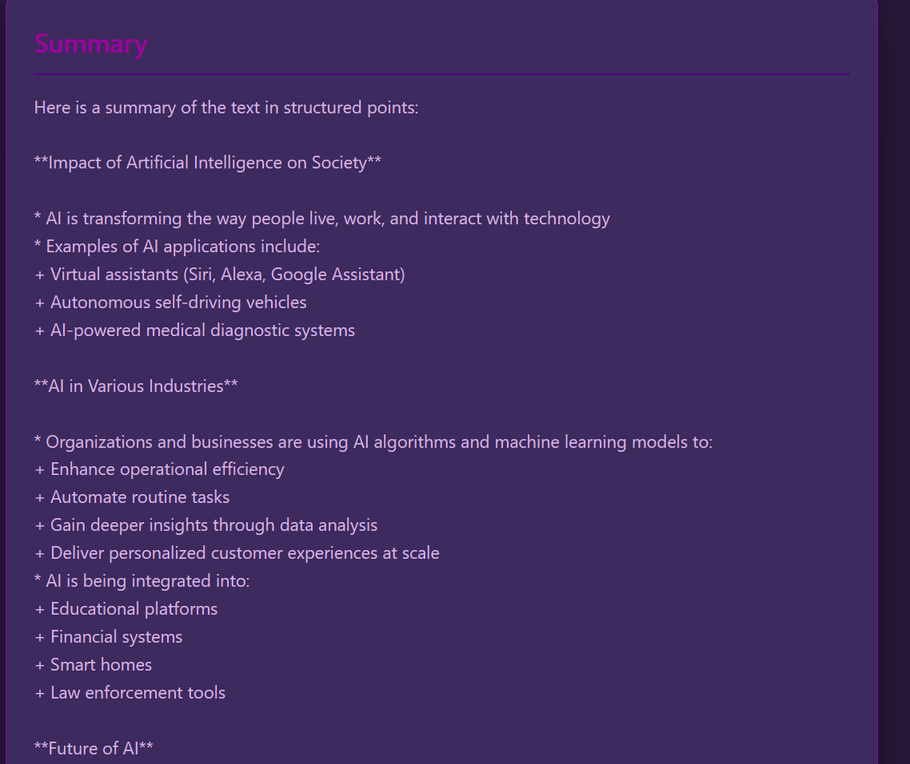
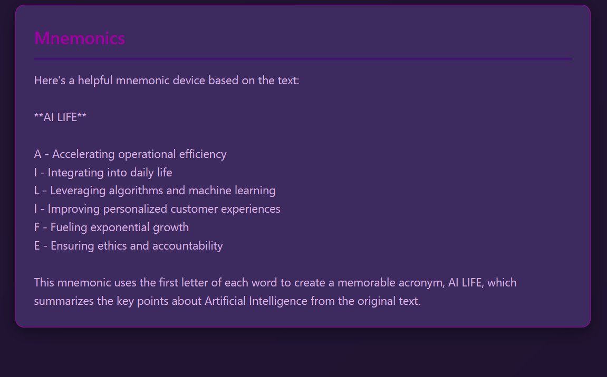
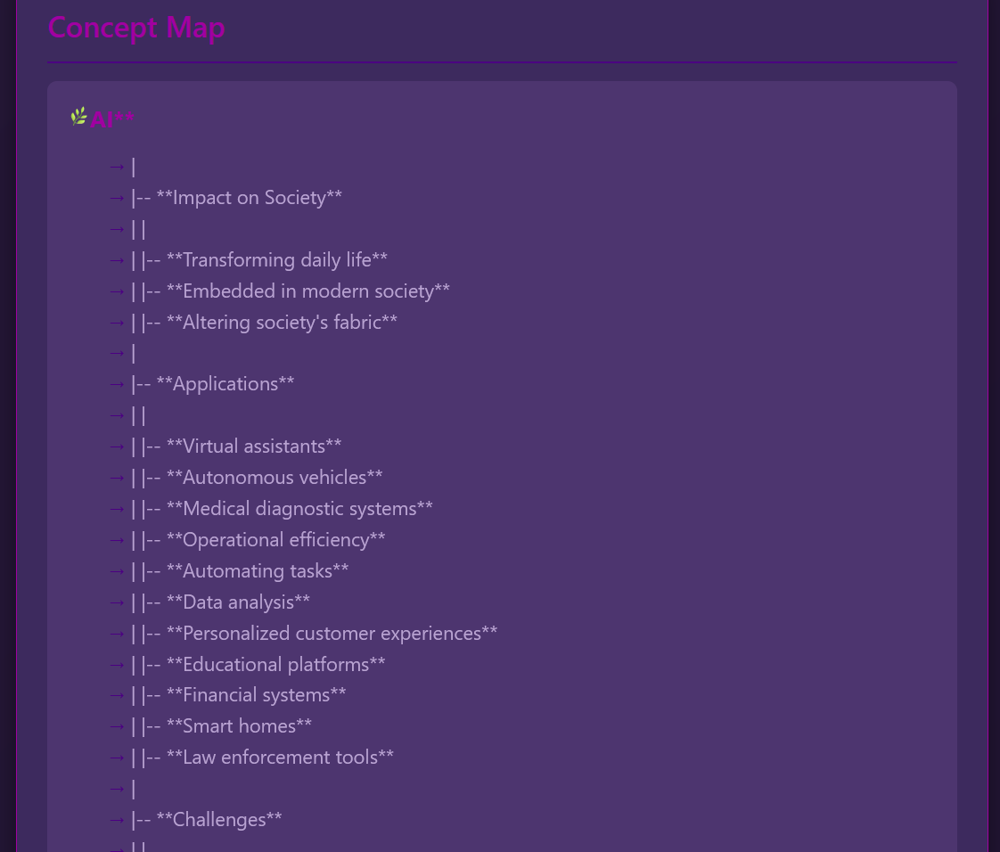

# 📚 Context-Aware Study Notes Generator

An AI-powered application that takes **a single topic (paragraph)** or an **entire chapter of a textbook** and intelligently generates:

- ✨ Concise Study Notes
- ❓ Question-Answer Flashcards
- 🧠 Mnemonics
- 🗺️ Concept Maps (in text form)

Built using **Langchain + Groq + LLMs** on the backend, and a modern **React frontend**.

---







## 🚀 Features

- 🔍 **Text-based Input**: Enter a topic paragraph or full chapter.
- 🧾 **AI-Generated Study Notes**: Key points and summaries for revision.
- ❓ **Question Generation**: All possible questions based on the input.
- 💡 **Mnemonic Generation**: Helps retain complex ideas.
- 🗺️ **Concept Map Output**: A structured representation of concepts.
- 🔗 **Langchain + Groq Integration**: Fast, structured LLM responses.
- 🎯 **Granular Modes**: Choose between "Single Topic" or "Full Chapter".
- ✅ **Modular Design**: Easily extensible for future GenAI features.

---

## 🧠 How It Works

### ✨ Powered by Langchain + Groq

We use **Langchain** to orchestrate prompts and parse outputs. The LLM is served through **Groq**, offering extremely fast inference using **llama3-70b-8192**.

### 🛠️ Pipeline

1. User inputs raw text (topic or chapter).
2. Langchain wraps it using custom prompts.
3. The input flows through:
   - Summary Prompt
   - QnA Prompt
   - Mnemonics Prompt
   - Concept Map Prompt
4. Groq processes the prompt via the Mixtral model.
5. Responses are parsed and returned as structured JSON.

---

## 🧱 Folder Structure

```bash
context-notes-generator/
│
├── backend/                     # FastAPI Backend
│   ├── main.py                  # API Routes
│   ├── prompts/                 # Custom prompt templates
│   │   ├── summary_prompt.txt
│   │   ├── qa_prompt.txt
│   │   ├── mnemonics_prompt.txt
│   │   └── concept_map_prompt.txt
│   └── utils/llm.py             # Langchain & Groq LLM logic
│
├── frontend/                    # React Frontend (Vite)
│   ├── src/
│   │   ├── components/          # React Components
│   │   ├── App.jsx              # Main Page
│   │   ├── main.jsx             # Entry Point
│   │   └── styles/app.css       # Tailwind-based styling
│   └── index.html
│
├── postman_collection.json      # Postman collection to test backend APIs
├── example_input.txt            # Sample topic/chapter text input
└── README.md
```

---

## 🧪 API Endpoints

| Method | Endpoint      | Description                           |
|--------|---------------|---------------------------------------|
| POST   | `/generate/topic`   | Generate outputs for a topic paragraph |
| POST   | `/generate/chapter` | Generate outputs for an entire chapter |

### Sample Payload:
```json
{
  "text": "Your topic or chapter content here"
}
```

---

## 🛠️ Installation & Setup

### 1. Clone the Repo
```bash
git clone https://github.com/your-username/context-notes-generator.git
cd context-notes-generator
```

### 2. Backend Setup

```bash
cd edubackend

pip install -r requirements.txt
uvicorn main:app --reload
```

Make sure you set your **Groq API key** in `.env`:

```
GROQ_API_KEY=your_key_here
```

### 3. Frontend Setup

```bash
cd edufrontend
npm install
npm run dev
```

---

## 🔍 Tech Stack

| Layer         | Tools |
|---------------|-------|
| Backend       | FastAPI, Python |
| AI Orchestration | Langchain |
| LLM Provider  | Groq (llama3-70b-8192) |
| Frontend      | React (Vite)|
| Deployment    | Optional - Render, Vercel, etc. |

---

## 🌐 Live Demo

(Include link here if deployed)

---


## ✨ Future Scope

- ✅ Export as PDF/Markdown
- ✅ Audio synthesis of notes
- ✅ RAG + personal memory store
- ✅ Multi-language support
- ✅ Real-time collaboration with classmates

---
